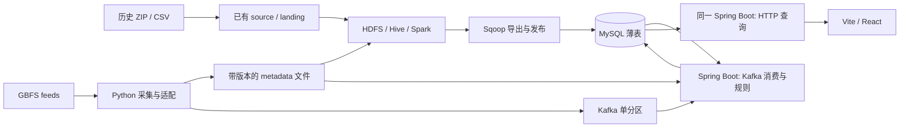

# 系统架构与模块边界

版本：Day 2 v1.1。规范入口为 [契约索引](contracts/README.md)，分工见 [交付计划](plans/delivery.md)。这里只固定进程、交接与写入职责，不规定内部类层次。

## 最小部署

集成环境是一台 Ubuntu 22.04（WSL2/OrbStack）。沿用 README 版本矩阵和双 JDK，不增加集群编排、缓存或第二套消息队列。

| 运行单元 | 运行时 | 责任 |
| --- | --- | --- |
| source / landing | Python 3 | 复用 citibike.historical_source、historical_landing；验证和落历史 CSV |
| offline | Spark 3.5.7 / Hive 3.1.3 / JDK 8 | DWD、DIM、flow/profile/OD；重建已接纳月份集合，先仅 2025-01 |
| export | Sqoop 1.4.7 / JDK 8 | 历史薄表导出 MySQL staging，校验后事务发布 |
| collector | Python 3 | 每 60 秒采集，保留 raw，生成 metadata 文件与 Kafka 记录 |
| backend | Spring Boot 3.2.x+ / JDK 17 | 同进程分别运行消费/规则/写入与只读 HTTP；fixture 模式禁用消费 |
| frontend | Vite + React + TypeScript | 一个页面，fixture 与 HTTP 共用响应结构 |
| Flume | 1.11.0 / JDK 8 | collector/backend 日志汇聚 HDFS /logs/citibike；课程集成证据，不承载业务数据 |

[runbook](runbook.md) 区分现有命令和约定的待实现入口。本次文档交付不表示这些业务程序已存在。

## 交接与唯一写入人

| 数据 | 生产者 / 唯一写入人 | 消费者 | 契约 |
| --- | --- | --- | --- |
| manifest、RAW、ODS、DWD | Hu-tong123 / #28，复用 S1lco 的 Day 1 成果 | offline | field_mapping、warehouse |
| canonical metadata 文件 | OGATA-LINA / #27 | offline、backend operations | field_mapping、events |
| DIM、flow、profile、OD、历史发布状态 | Hu-tong123 / #28 | API、operations | warehouse、serving.sql |
| Kafka station 记录与快照结束记录 | OGATA-LINA / #27 | operations | events |
| 当前风险、调度、实时发布状态 | 1giaowoligiaogiao / #29 | API | operations、serving.sql |
| HTTP 响应 | S1lco / #26 | Yeman-sker / #30 | openapi.yaml |
| UI 设计与页面交互 | Yeman-sker / #30 | 用户；S1lco 复核接口集成 | product |

GBFS metadata 以不可变文件 `$DATA_DIR/gbfs/metadata/<metadata_version>.json` 交接：完整写临时文件后改名，同机 backend/offline 只读。内容为 canonical metadata 数组，原始响应另存。历史 DIM 在离线发布时合并 metadata；实时 ADS 直接使用事件绑定的 metadata 版本，新站点无需等离线重跑才能上图。

首次运行先启动 backend/collector 生成 metadata 与无基线的当前状态，再跑历史发布；下一批完整快照补预测。成员本机开发各用独立库/fixture；#30 在 Day 3 明确唯一真实集成主机、DATA_DIR 和服务连接。跨机交接必须先复制对应 hash 的 metadata 文件，不能只发本机路径。DWD 的文件记录位置从 RAW 读取边界保留，ODS 用于核对，见 warehouse。

## 目录与冲突边界

| 目录/文件 | 主维护人 | 规则 |
| --- | --- | --- |
| frontend/、UI 原型 | Yeman-sker | UI 设计与完整前端；其他成员提供字段、样例及集成证据 |
| citibike/historical*、citibike/offline.py、hive/、sql/ | Hu-tong123 | 唯一 DWD 产出者，数仓及 MySQL DDL、离线导出 |
| citibike/gbfs*、collector 配置 | OGATA-LINA | 复用采集器，source 契约变化同步共享测试 |
| backend/ 的 pom.xml、应用入口、resources、api/ | S1lco | Maven 工程与完整 API，Day 3 尽早合并最小入口 |
| backend/ 的 operations/ | 1giaowoligiaogiao | 纯规则、Kafka 消费、实时 ADS writer，与 API 同 JVM |
| citibike/contracts.py、fixtures/day2/、契约测试、CI | 领域负责人提出，Yeman-sker 协调 | 同一共享文件同一时间由一个 PR 修改 |
| docs/product、contracts/openapi | Yeman-sker、S1lco 分别主维护 | 交叉评审，不增加重复 view-model 规格 |

Day 3 开始一小时内，#26 先提交只含可编译 Maven 入口、包名、无外部服务单测和 Java CI 的最小 PR，再做查询；组长优先评审。#29 同时用 JDK 17 编译纯规则并运行 assert 算例（`java -ea`），入口合并后接入同一 Maven 工程；不得因为缺数据库或 Kafka 而让规则单测启动失败。共同 pom/resources 由 #26 修改，#29 在 Issue 给出必要依赖/配置清单。#30 的首个前端工程 PR 同时加入 npm ci/build 的 CI；两项 CI 修改按最小后端→前端顺序合并，后者同步主干，不等业务联调。依赖版本在各自首个实现 PR 锁定，不增加当前尚无工程的占位 CI。

## 发布与读取

- 历史薄表经 staging 校验后一次事务替换；实时风险和建议在另一个事务整体替换。字段与约束见 warehouse。
- 每个 map 请求用一次 MySQL 一致性读事务读取发布状态和数据，live 同时返回风险与建议，不拼接不同批次。
- operations 每批开始读取一个已发布历史版本的 profile，保留版本至整批结束。无历史版本仍发布有效当前状态，预测标为数据不足。
- API 不读 RAW/DWD、不重新预测、不运行 Spark；使用 operations 提供的到期判定屏蔽过期结论。
- 离线更新不修改当前实时批次，下一完整快照才用新基线；响应保留实际 baseline_dataset_id。

## 替身与真实验收

[共享 fixture](../fixtures/day2/README.md) 提供源输入、全量小型表、事件和 HTTP 期望。Day 3 各模块从自己的边界开工，不等待真实上游；fixture 模式只替换加载，业务与异常语义相同。

真实验收经过 HDFS/Hive/Spark、Sqoop/MySQL、Kafka、Spring Boot、浏览器。file replay 可验证规则和页面；通过 Kafka 发送录制事件可验证 Kafka 链路，但仍另留三次真实采集证据。环境不可用时记录缺口，替身通过不能记为最终集成完成。
