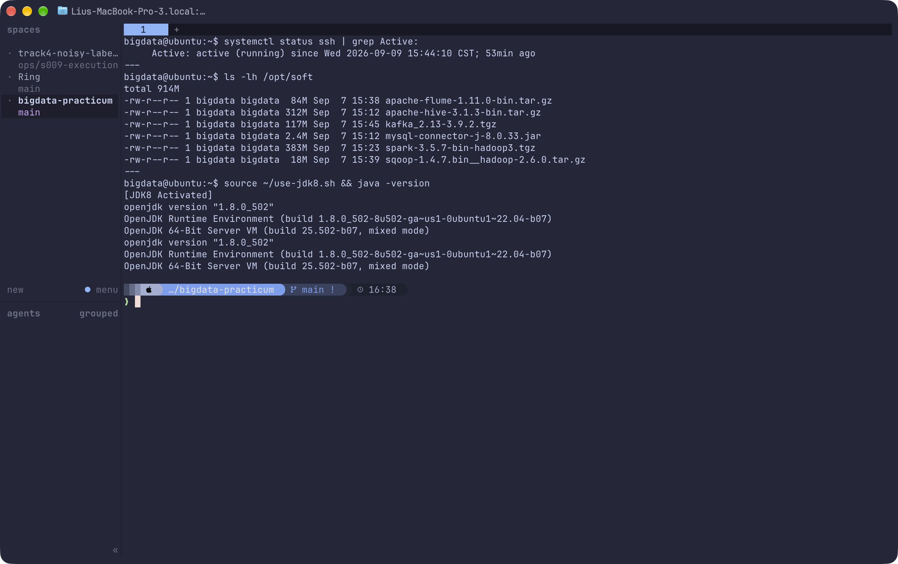

# 生产实习日志 - 2026年09月07日 (Day 1)

* **学号**：2023216294
* **姓名**：刘文博
* **专业**：数据科学与大数据技术
* **班级**：2326903
* **企业导师**：刘洪浩（东软教育科技集团有限公司）
* **学校导师**：蔡友林，李荣，李丽华，徐亮

---

## 实习记录

### 【今日学习与任务】
今天是生产实习第一天，由东软的刘洪浩老师带大家入门。课上主要介绍了大数据的基础概念，重点讲解了 Hadoop 里的 MapReduce 计算框架。老师通过统计文章里每个单词出现次数的例子，通俗地解释了它是怎么把大任务拆开分别统计（Map）、最后再按单词汇总合并（Reduce）的，对照流程图听起来比较好理解。下午的任务主要是准备实验环境，要求在 Ubuntu 22.04 虚拟机里把远程连接配置好，并把后续实操要用到的几个大数据安装包提前准备就绪。

### 【动手操作过程】
我结合老师课上演示的操作笔记，在本地的 Ubuntu 22.04 虚拟机里完成了环境准备：
1. 检查并重置了系统的字符集编码（设置 LANG 为 `en_US.UTF-8`），避免后续敲命令和看日志时出现中文乱码；
2. 安装了 OpenSSH 服务并设置开机自启，在配置文件里开启允许 root 登录并放行防火墙，测试可以通过本地终端直接连入虚拟机，方便后续操作；
3. 在虚拟机的 `/opt/soft` 目录下检查了老师统一提供的安装包，包括 Hadoop 3.3.6、Hive 3.1.3、Spark 3.5.7、Kafka、Flume 以及 MySQL 驱动包，确认各文件大小完整；
4. 针对不同软件对 Java 版本的不同要求（Hadoop 系列用 Java 8，Kafka 和后端构建用 Java 17），提前在本地配置好了快捷切换脚本，测试 Java 运行正常。

### 【遇到的小问题与解决】
1. 刚进入系统时控制台有语言包报错的提示，按照笔记执行了 `locale-gen` 清理并更新语言环境，重启后恢复正常；
2. 在检查 Java 版本时习惯性输入了 `java --version` 导致报错，才注意到 Java 8 规范只认单横线的 `java -version`，后续操作时需要注意参数习惯。

### 【实操结果截图】

*图 1-1：Ghostty 终端查看 Ubuntu 基础环境与 /opt/soft 安装包列表*

### 【今日心得】
今天第一天主要是搭好底层的 Linux 系统，把后面几天要用的大安装包都提前核对放好。虽然还没开始正式装集群，但提前把网络、远程连接和 Java 环境理清楚，能避免后面安装时踩坑，明天准备正式开始解压和配置 Hadoop。
