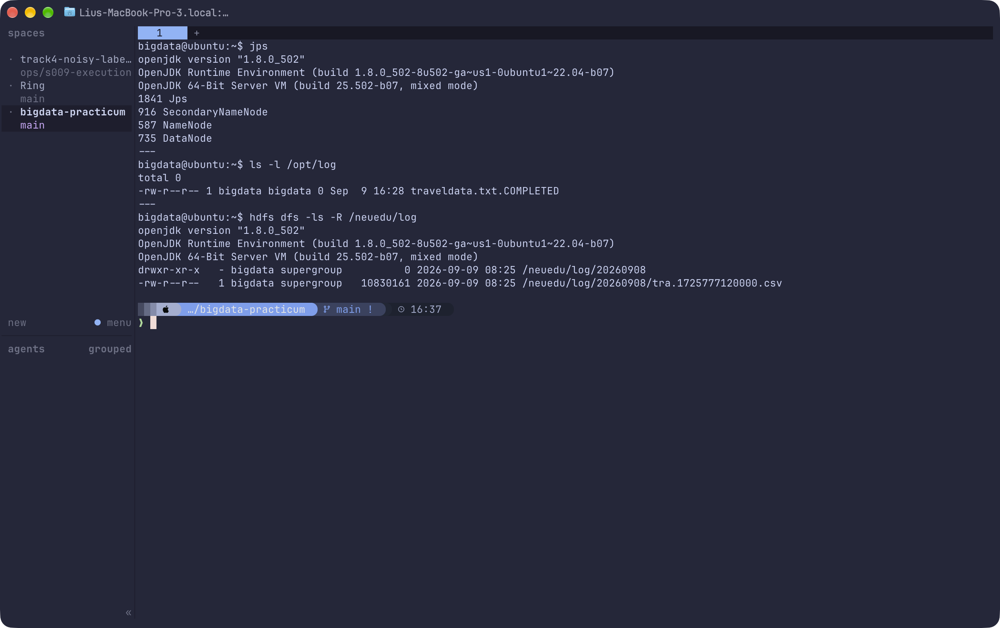
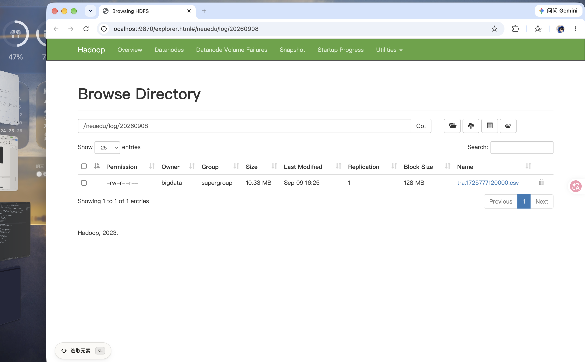

# 生产实习日志 - 2026年09月08日 (Day 2)

* **学号**：2023216294
* **姓名**：刘文博
* **专业**：数据科学与大数据技术
* **班级**：2326903
* **企业导师**：刘洪浩（东软教育科技集团有限公司）
* **学校导师**：蔡友林，李荣，李丽华，徐亮

---

## 实习记录

### 【今日学习与任务】
今天主要学习并实操了 Hadoop HDFS 分布式文件系统的部署，以及使用 Flume 工具进行日志数据采集。课上首先解压并配置了 Hadoop 3.3.6，完成了 core-site.xml 和 hdfs-site.xml 的基础参数设置，格式化并拉起了 HDFS 节点；接着学习了 HDFS 的常用命令行操作和通过浏览器（9870 端口）查看目录结构；下午重点配置了 Flume Agent，编写了监听本地目录的配置文件，任务是把老师给的 `traveldata.txt` 旅游数据通过 Flume 自动采集并上传保存到 HDFS 目录中。

### 【动手操作过程】
按照老师的操作演示，在本地 Ubuntu 22.04 虚拟机里依次完成了以下操作：
1. **解压配置 Hadoop**：在 `/opt/soft` 目录下将 `hadoop-3.3.6` 解压到 `/opt/hadoop`，在 `/etc/profile.d/` 中配置好环境变量并 source 刷新生效；
2. **基础配置与节点格式化**：修改 `core-site.xml`（设置默认文件系统为 `hdfs://localhost:9000`、指定本地临时存储目录），修改 `hdfs-site.xml` 设置副本数为 1。接着执行 `hdfs namenode -format` 完成格式化，并使用 `start-dfs.sh` 成功启动 HDFS，`jps` 确认 NameNode、DataNode 和 SecondaryNameNode 正常运行；
3. **HDFS 命令与 Web 界面测试**：在命令行测试执行 `hdfs dfs -mkdir -p /neuedu/log` 创建目标目录，并通过浏览器访问 `http://localhost:9870/explorer.html` 看到新创建的目录，验证了命令行与网页端的一致性；
4. **配置并运行 Flume 采集**：解压 Flume 1.11.0 并配置 `file-hdfs.conf`，设置 Source 为 spooldir 监听 `/opt/log` 目录，Sink 设置为 HDFS Sink（路径指向 `/neuedu/log/%Y%m%d` 并开启本地时间戳解析）。启动 Flume Agent 后，将 `traveldata.txt` 放入 `/opt/log` 目录，观察到文件被自动追加 `.COMPLETED` 后缀，同时在 HDFS 成功生成了切分好的 csv 数据文件。

### 【遇到的小问题与解决】
1. 在初次启动 Flume 往 HDFS 写入时报了无法解析路径日期的错误，检查发现是因为配置里的 `hdfs.path` 用了 `%Y%m%d` 占位符，但缺少了 `a1.sinks.k1.hdfs.useLocalTimeStamp = true` 参数，加上该项后 Flume 使用本机时间顺利创建了当天的日期子目录；
2. 刚格式化完 NameNode 启动时，初次写入报了 `Name node is in safe mode` 处于安全模式错误，通过执行 `hdfs dfsadmin -safemode leave` 主动退出安全模式后，文件写入与目录创建顺利完成。

### 【实操结果截图】

*图 1-2：Ghostty 终端查看 HDFS 进程与 /opt/log、HDFS 目录验证*

*图 1-3：Google Chrome 浏览器访问 9870 端口查看 HDFS 落地 CSV 文件*

### 【今日心得】
今天把 Hadoop 的存储层和 Flume 采集工具串起来跑通了一遍，亲手看到了本地文件被 Flume 自动抓取并推送到 HDFS 目录的过程，对大数据“采集到存储”的具体链路有了直观感受。配置的时候参数比较多，路径和时间戳的小配置稍微漏掉就会报错，动手排查一遍后对组件之间的调用机制更清楚了，明天准备继续学习后面的数据计算和分析模块。
