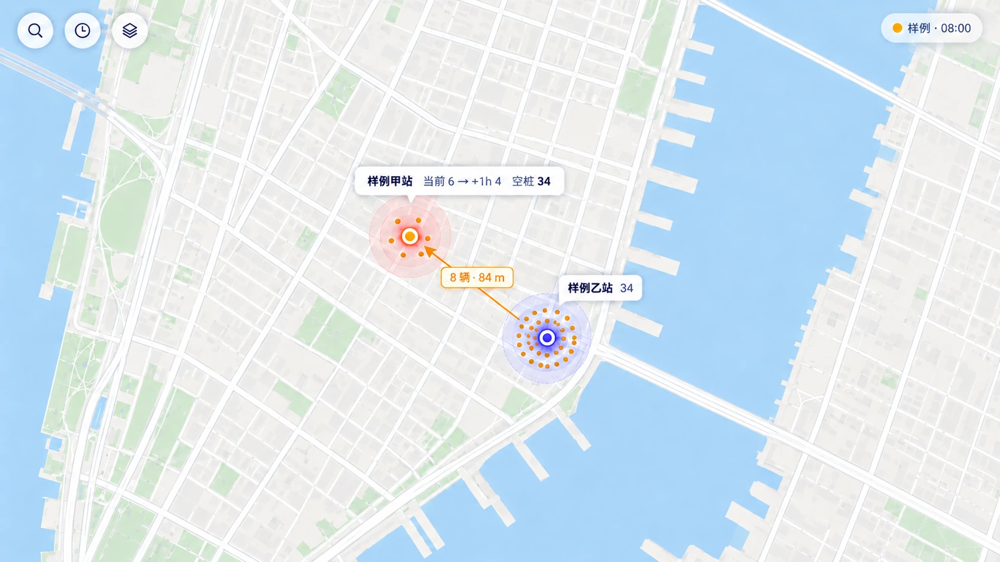
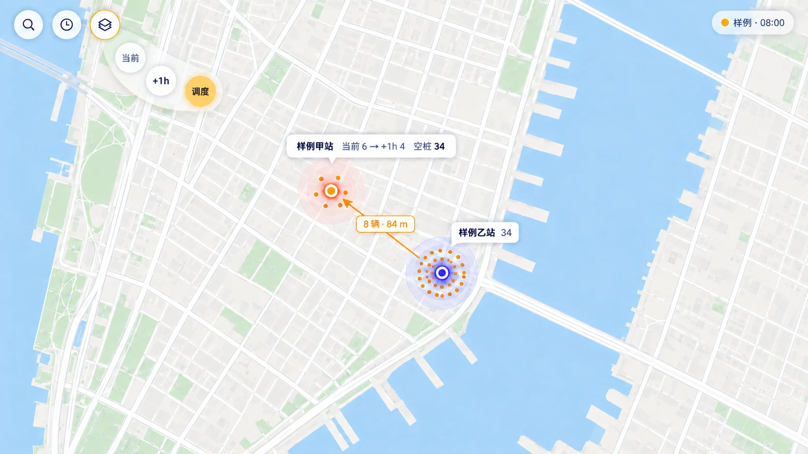
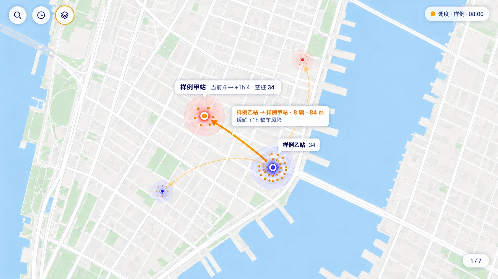
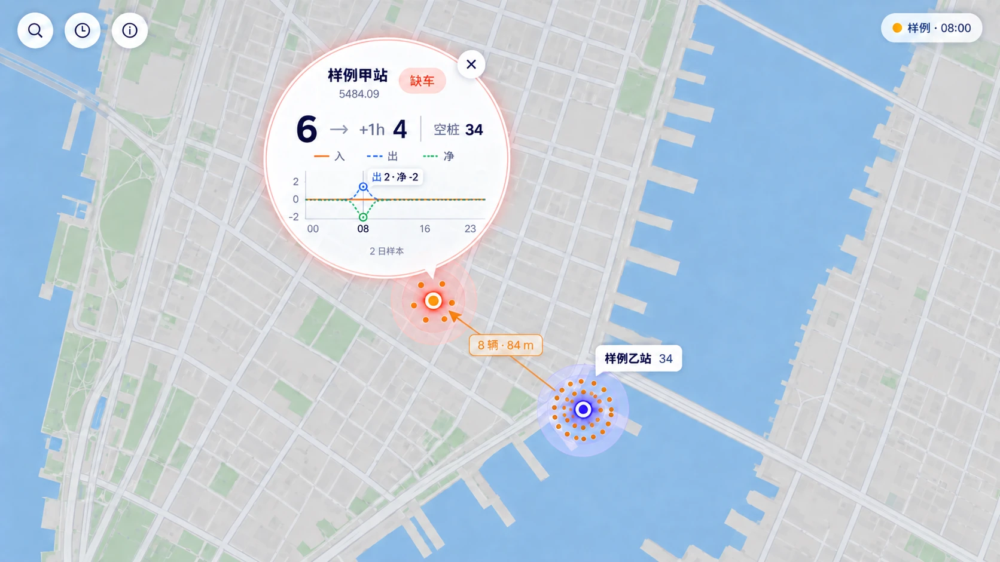
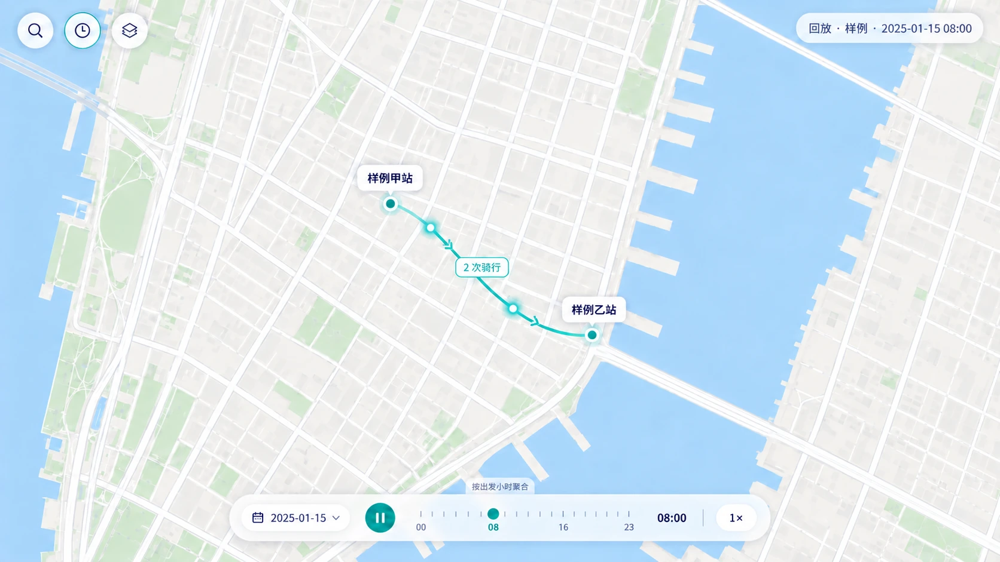
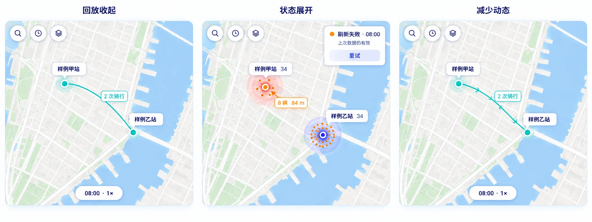
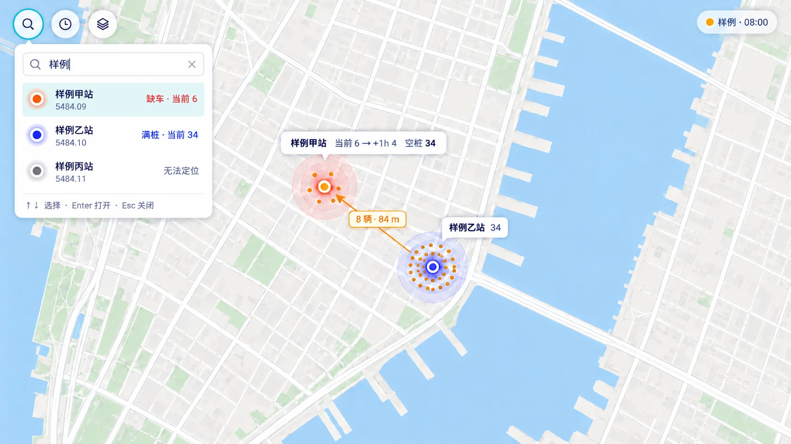
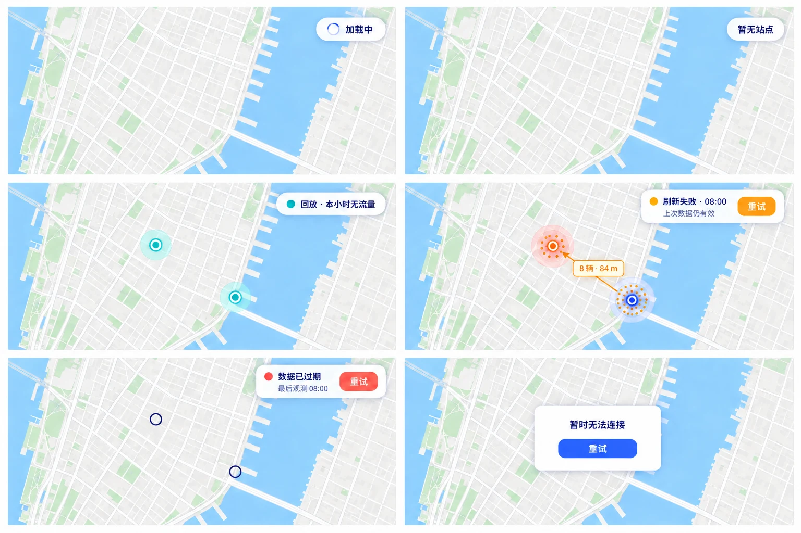

# 前端交互与视觉设计

状态：2026-09-15 已完成 P0 高保真产品原型与交互定稿；实现与浏览器证据由 [Issue #30](https://github.com/Yeman-sker/bigdata-practicum/issues/30) 跟踪。根目录 [DESIGN.md](../DESIGN.md) 提供机器可读的规范视觉 token，本文细化 [产品与交互](product.md) 的状态与操作，不重复 [OpenAPI](contracts/openapi.yaml) 字段或 [风险与调度规则](contracts/operations.md)。数据契约版本仍为 `1.1`。

## 设计决定

- 地图就是页面：视口内不设常驻顶栏、侧栏、Tab、列表或 KPI 卡片。
- 常驻界面只保留三个图标按钮和右上角数据状态；其余信息随站点、调度线或历史控件的选择出现。
- 黄色粒子只表示实际可用车辆，风险由光晕表达，历史 OD 使用青绿色流线；三种语义不能混用。
- 文字尽量靠近其地图对象。视觉稿用于说明层级，字段值、空值和状态行为仍以契约与本文文字为准。
- P0 先支持 `1280×720` 及以上桌面视口；不为本周期增加移动端、多页面导航或独立组件库。

## 高保真原型索引

| 状态 | 原型 | 实现用途 |
| --- | --- | --- |
| 实时地图 | [live-map.webp](assets/frontend/live-map.webp) | 默认层级、粒子、光晕与地图标注 |
| 地图视角拨盘 | [view-dial.webp](assets/frontend/view-dial.webp) | 当前、`+1h`、调度的临时选择器 |
| 调度建议选中 | [dispatch-selected.webp](assets/frontend/dispatch-selected.webp) | 多线路层级、方向与就地详情 |
| 站点地图透镜 | [station-lens.webp](assets/frontend/station-lens.webp) | 站点详情、曲线与锚点关系 |
| 历史回放展开 | [historical-replay.webp](assets/frontend/historical-replay.webp) | 日期、时间轴、播放与倍速 |
| 搜索展开 | [search-expanded.webp](assets/frontend/search-expanded.webp) | 即时结果、键盘选择与无坐标站点 |
| 加载、空与失败 | [system-states.webp](assets/frontend/system-states.webp) | 六类系统反馈及重试入口 |
| 紧凑与减少动态 | [compact-states.webp](assets/frontend/compact-states.webp) | 回放收起、状态展开与静态方向表达 |

## 实时地图

图中叠加了一条已选中的调度建议，用于说明空间标注关系；各视角的默认图层以“地图视角拨盘”表格为准。

左上角三个 `44px` 圆形按钮依次为搜索、实时/回放和地图视角。右上角状态胶囊显示来源、观测时间和新鲜度；`FIXTURE`、`GBFS_REPLAY` 不得省略来源提示。地图标签默认隐藏，只在悬停、键盘聚焦或选择时出现。

### 地图图层

| 图层 | 视觉编码 | 行为 |
| --- | --- | --- |
| 当前库存 | 锚定站点的琥珀色粒子 | 粒子数等于有效 `num_bikes_available`；不表示车辆 GPS。负数、过期或非法库存不绘制，也不改画为零。 |
| 当前/预测风险 | 站点光晕 | 缺车为珊瑚色圆环，满桩为蓝紫色圆环；低/高风险使用对应色的虚线单环，严重风险使用实线双环和不同中心图形。异常使用灰色斜纹环及文字状态。 |
| 调度 | 指向接车站的琥珀色静态线 | 线宽按 `move_bikes` 分级；中点胶囊只显示数量和距离。默认突出 Top 5，其余建议仅在调度视角以低透明度呈现。 |
| 历史 OD | 青绿色曲线、方向箭头和运动点 | 方向从出发站到到达站；标签显示 `ride_count`。它不表示连续库存或逐车轨迹。 |

粒子位置以 `station_id` 派生稳定偏移，同一库存不应在刷新时随机跳动。缩小时只减小粒子半径和非选中标签，不减少粒子数量；性能优化不得改变图例与数量语义。

## 地图视角拨盘

点击图层按钮或按 `Enter` / `Space` 展开临时拨盘；选择后或按 `Escape` 收起。它不是常驻 Tab。

| 视角 | 地图内容 |
| --- | --- |
| 当前 | 实际库存粒子 + `current_status` 光晕；隐藏调度线。 |
| `+1h` | 实际库存粒子不变，只将光晕切为 `forecast_status`；隐藏调度线。 |
| 调度 | 实际库存粒子不变，预测光晕降低透明度；Top 5 调度线突出，其余有效建议低透明度可选。 |

切换视角不发起新的 live 请求，也不改变同批建议集合。调度选项附建议总数；方向键或点击选择调度线，选择后显示来源、目标、数量、距离和依据。大量线条重叠时仍保持 Top 5 清晰，其他线只在悬停、聚焦或选中时提高透明度。

## 调度建议选中

调度视角进入后按契约排序绘制全部有效建议：Top 5 使用中等透明度，其余建议使用低透明度。点击路线或用 `[` / `]` 巡览时，只有当前建议提升为实线并置于最上层，其来源站和目标站同时获得焦点环；其他路线继续保留空间背景，但不得争夺标签。

选中路线的就地胶囊固定两行：第一行是“来源 → 目标 · 调度数量 · 距离”，第二行是触发建议的风险依据。胶囊优先放在线段中点的空白侧，并保持 `16px` 地图边距；空间不足时沿线移动，不改成边缘面板。可见线条之外使用至少 `12px` 的透明命中描边，保证细线可点击。

线路重叠时层级固定为“当前选中 → Top 5 → 其他建议”；不做线路捆绑或边缘列表。点击地图空白或按 `Escape` 清除当前路线选择，恢复 Top 5。新快照移除该建议、任一端点失效或数据过期时立即清除选择和胶囊。

## 站点地图透镜

点击站点或在站点聚焦时按 `Enter`，在锚点附近展开圆形透镜。地图不切页、不缩放；只为保证透镜保留 `24px` 视口边距而轻微平移。空间不足时透镜自动翻到锚点另一侧。

实时透镜按以下层级展示：

1. 站名、字符串 `station_id` 和文字状态。
2. 当前车辆数、未来一小时估计和空桩数。
3. 24 小时平均流入、流出、净流量；三条线同时用颜色和线型区分。
4. 当前小时标记、`sample_days`、观测时间和预测目标时间。精确时间在对应数值悬停或聚焦时显示。

点击关闭按钮、地图空白处或按 `Escape` 收起；焦点返回原站点。透镜为非模态区域，不锁住地图键盘操作。无坐标站点通过搜索仍可打开透镜，此时透镜居中显示“无法定位”且不绘制指针。

- 无基线：保留有效当前库存，预测显示 `—`，曲线区显示“暂无历史基线”，不补零。
- 历史模式：不显示库存、风险、预测或调度；透镜叠加选定日期实际流量与同星期 profile。
- 当日无活动：保留 profile，实际曲线不绘制并显示“当日无活动”。

## 历史回放

点击时钟按钮进入回放并读取 availability。默认最新可用日期和该日最早小时；切换日期先暂停，再落到新日期最早可用小时。实时库存、风险、预测和调度图层全部卸载，不能与历史流向叠加。

底部回放胶囊只在进入回放、指针靠近或键盘聚焦时展开；播放期间空闲后收为 `08:00 · 1×` 小胶囊。展开态包含：

- 原生日期输入，但提交前必须验证日期属于 availability；
- 播放/暂停按钮和 24 小时时间轴；
- 当前小时；
- 单个倍速按钮，点击或方向键在 `0.5× / 1× / 2× / 5×` 间切换。

`1×` 每个业务小时播放 2 秒；到最后可用小时自动暂停，不跨日循环。拖动小时、切换日期或退出回放后，只允许最后一次请求更新页面。已加载小时仅在内存复用。

缺坐标的 OD 不绘制；状态胶囊显示未绘制的 OD 条数和骑行数，接口记录仍保留。`ride_count` 决定可见数量和线宽，繁忙时可以关闭装饰运动点，但不能改写数量。

### 紧凑回放与减少动态

回放胶囊在进入模式、暂停、指针进入或键盘聚焦时保持展开；播放且连续 `3s` 无交互后收成一个 `08:00 · 1×` 按钮。点击或聚焦这个按钮重新展开；收起不会暂停播放。展开期间日期、小时、播放状态和倍速保持原值，不因动效切换重新请求数据。

`prefers-reduced-motion: reduce` 下不自动收起用户正在聚焦的控件，取消 OD 运动点、粒子漂移和光晕呼吸，仅保留静态曲线及重复方向箭头。播放仍按所选倍速逐小时更新数据，数量、时间轴和自动暂停规则不变。

## 搜索与空间巡览

搜索按钮展开站名或 ID 输入框，只筛选当前响应中已加载站点，不新增服务端搜索。浮层宽 `360px`、最大高 `384px`，窄桌面下使用 `min(360px, calc(100vw - 48px))`；结果行最小高 `64px`，最多显示 8 个即时结果并在浮层内部滚动。

打开后焦点直接进入输入框。结果同时展示站名、字符串 ID 和当前模式下最重要的一条文字状态；无坐标站点明确标记“无法定位”，但仍可打开居中透镜。方向键移动、`Enter` 定位并打开透镜、`Escape` 关闭并恢复搜索按钮焦点。输入无匹配时只显示“没有匹配站点”，不把地图清空；清空输入恢复默认结果。

取消常驻风险列表后，空间巡览沿用原排序规则：严重风险优先、其次低/高库存，再到服务或数据异常，同类按字符串 `station_id` 排序。`N` 跳到下一站，`Shift+N` 返回上一站；调度视角用 `[` / `]` 巡览建议。搜索面板底部和各按钮工具提示公开这些快捷键，不能只靠记忆操作。

## 临时浮层与状态冲突

页面同时只允许一个富信息浮层展开，避免重新形成面板式界面。路线高亮属于地图选择，可作为站点透镜的背景保留；回放紧凑胶囊属于模式控件，不占用富信息浮层名额。

| 新打开的状态 | 自动收起 | 可以保留 |
| --- | --- | --- |
| 搜索 | 视角拨盘、站点透镜、状态说明、回放展开态 | 路线高亮、回放紧凑胶囊 |
| 视角拨盘 | 搜索、站点透镜、状态说明、回放展开态 | 当前站点选择、回放紧凑胶囊 |
| 站点透镜 | 搜索、视角拨盘、状态说明、回放展开态 | 相关路线高亮、回放紧凑胶囊 |
| 状态说明 | 搜索、视角拨盘、站点透镜、回放展开态 | 地图选择、回放紧凑胶囊 |
| 回放展开态 | 搜索、视角拨盘、站点透镜、状态说明 | 当前 OD 选择 |
| 首次加载失败卡片 | 所有地图浮层和选择 | 仅底图 |

点击地图空白或按 `Escape` 只关闭当前展开浮层，不改变实时/回放模式、日期、小时或视角；退出回放必须再次点击时钟按钮。浮层关闭后焦点返回触发按钮，透镜关闭后返回原站点锚点。打开新浮层时先关闭旧浮层并完成焦点交接，再播放新浮层的 `160–220ms` 展开动效。

## 加载、空态与失败

| 状态 | 地图与状态胶囊 | 操作 |
| --- | --- | --- |
| 首次加载 | 底图可见，数据图层为空；胶囊显示“加载中” | 等待或取消，不显示零库存结论。 |
| `200` + 空数组 | 保留底图；胶囊显示“暂无站点”或“本小时无流量” | 可搜索其他日期/小时或返回实时。 |
| 刷新失败但旧结果仍新鲜 | 保留最近成功图层；胶囊变为琥珀色“刷新失败 · 原时间” | 点击胶囊重试。 |
| 数据过期 | 卸载库存粒子、预测与调度；保留空心站点锚点；胶囊显示“数据已过期” | 展开胶囊查看上次观测时间并重试。 |
| 无基线 | 当前库存与当前风险正常显示；`+1h` 使用灰色虚线环 | 透镜说明“暂无历史基线”，不生成调度。 |
| 停服/非法数据 | 不绘制库存粒子；站点使用斜纹异常环 | 透镜显示固定状态与 reason 对应说明。 |
| `400/404/422` | 保留或恢复上一个合法选择；出现一行临时提示 | 重新加载 availability 或缩小查询范围。 |
| 首次 `503` / 网络失败 | 只显示底图和一个居中重试按钮 | 不用 fixture 或零值冒充成功结果。 |

状态胶囊默认保持单行；警告或失败时点击后向下展开一行说明和一个“重试”按钮，最大宽 `360px`。重试期间只禁用该按钮并显示行内进度，不清空仍然有效的地图。点击空白或按 `Escape` 收起，错误标记继续保留直到成功恢复。

加载和状态变化通过 `aria-live="polite"` 宣告；首次加载失败使用居中卡片并把焦点放到“重试”，因为此时地图没有可操作业务数据。`200` 空结果仍是成功：实时显示“暂无站点”，回放显示“本小时无流量”，两者不使用错误色。

| 触发 | 主文案 | 辅助文案 / 行为 |
| --- | --- | --- |
| 首次加载 | 加载中 | 不显示业务结论。 |
| 实时空结果 | 暂无站点 | 保留底图和模式控件。 |
| 回放空结果 | 本小时无流量 | 保留站点锚点和回放控件。 |
| 刷新失败且缓存仍有效 | 刷新失败 · `{HH:mm}` | 上次数据仍有效；提供“重试”。 |
| 数据超过有效期 | 数据已过期 | 最后观测 `{HH:mm}`；提供“重试”。 |
| 首次网络失败 / `503` | 暂时无法连接 | 居中显示“重试”。 |
| 无历史基线 | 暂无历史基线 | 当前库存可保留，预测显示 `—`。 |
| 确认停服 | 服务不可用 | 不绘制库存、预测和相关调度。 |
| 非法库存或字段 | 数据异常 | 不把非法值改写为零。 |
| `400` | 所选参数无效 | 恢复上一个合法选择。 |
| `404` | 该站点或日期不可用 | 恢复选择并重新加载 availability。 |
| `422` | 查询范围过大 | 恢复选择并提示缩小范围。 |

`400/404/422` 不新增 toast 组件，统一复用右上状态胶囊的展开行；`4s` 后自动收起，但指针悬停或键盘焦点停留时不计时。恢复后台标签页时立即刷新；旧请求晚到不得覆盖当前模式、日期、小时或站点选择。

## 视觉规范

颜色、字体、间距、圆角和基础组件 token 以 [DESIGN.md](../DESIGN.md) 为规范值；本节说明这些 token 在业务图层中的用途。两处发生冲突时先修正文档，并以 `DESIGN.md` 的机器可读值实现。

| 用途 | 规范 |
| --- | --- |
| 底图 | 暖白道路与低对比建筑，水域 `#BFE3F6`，绿地 `#DDEBD7`；业务图层始终高于地名。 |
| 正文 | `#0B1741`；字体使用系统栈 `Inter, PingFang SC, Microsoft YaHei, sans-serif`，不下载自定义字体。 |
| 实时库存/调度 | 琥珀色 `#F5A000`。 |
| 缺车/偏低 | 珊瑚色 `#FF5A5F`，严重状态用实线双环，较低风险用虚线单环。 |
| 满桩/偏高 | 蓝紫色 `#5B5CE2`，并使用不同于缺车的中心方形。 |
| 历史 OD | 青绿色 `#11A8A5`，避免与实时库存混淆。 |
| 浮层 | `rgba(255,255,255,.92)`、`1px` 浅灰边线、轻阴影；圆形按钮 `44px`，透镜桌面最大 `400px`。 |
| 动效 | 控件展开/收起 `160–220ms`；地图数据更新不闪白。`prefers-reduced-motion` 下取消粒子漂移和流线运动，只保留方向箭头。 |

布局使用 `8px` 基准网格。视口安全边距为 `24px`，圆形按钮间距 `12px`；胶囊最小高 `44px`，正文圆角 `16px`，大型透镜保持圆形。语义堆叠顺序固定为：底图 → 地名 → 非选中业务线 → 站点粒子与光晕 → 选中路线 → 地图就地标签 → 富信息浮层 → 全局控件 → 首次失败卡片。实现可以选择具体 `z-index`，但不能改变该顺序。

所有图标按钮必须使用原生 `button`，提供可见焦点环、`aria-label` 和悬停/聚焦提示。点击目标不小于 `44×44px`；颜色不是唯一状态编码。透镜关闭后、临时控件收起后都要恢复触发元素焦点。

## P0 验收映射

| 路径 | 可见结果 |
| --- | --- |
| 实时态势 | 默认地图展示实际库存粒子、当前风险光晕、来源与观测时间。 |
| 一小时风险 | 视角拨盘切到 `+1h`；粒子不变，只有光晕与透镜预测状态变化。 |
| 调度 | 调度视角突出 Top 5，其他同批建议可巡览；样例展示乙→甲 `8` 辆、`84m`。 |
| 历史回放 | 日期、小时、播放和四档倍速控制青绿色非零 OD；不出现任何实时图层。 |
| 站点分析 | 同一站点透镜展示 profile、实际流量、样本日和缺基线/无活动状态。 |

视觉稿不代替浏览器验收。实现必须继续覆盖刷新竞态、过期、非法库存、无坐标、空结果、键盘操作和减少动态效果。

## 明确不做

不增加右侧列表、常驻顶栏、登录、司机执行按钮、逐车 GPS、持久缓存、移动端专版、三维地图、独立动效引擎或 P1 KPI。只有实际 P0 使用测试证明空间巡览无法完成任务时，才重新评估列表视图。
